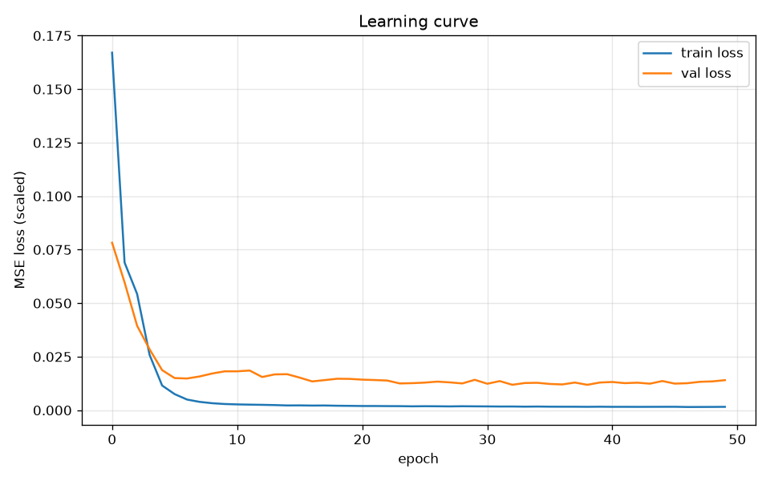
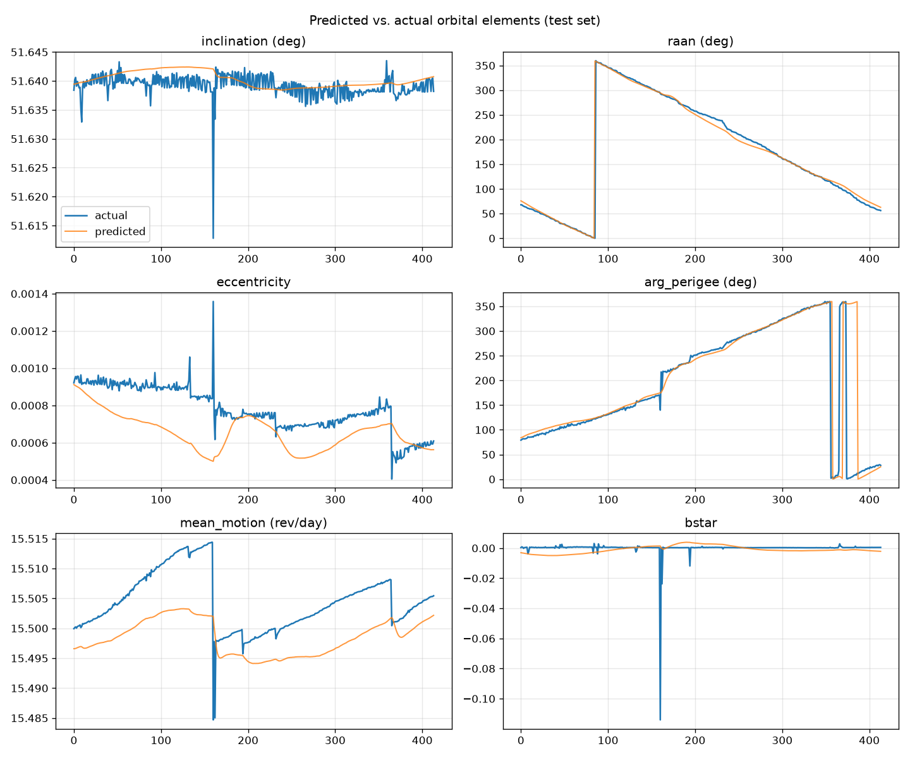
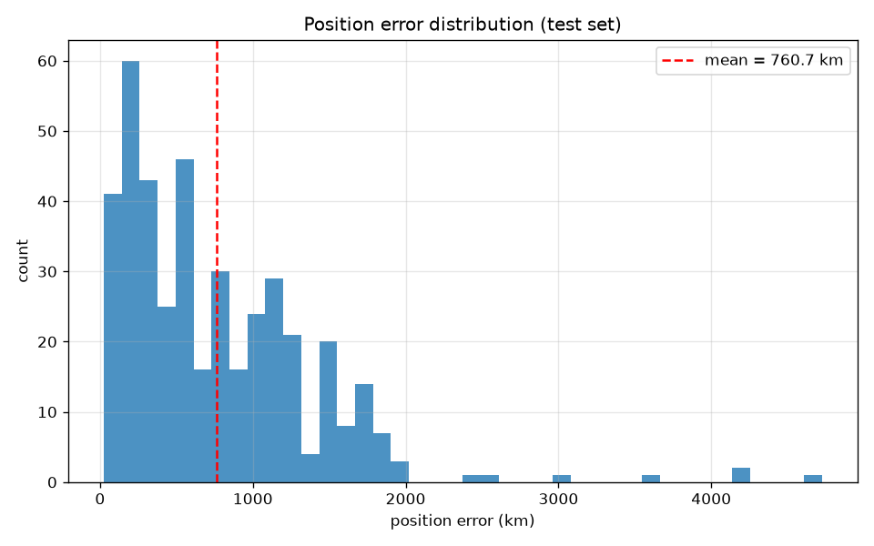
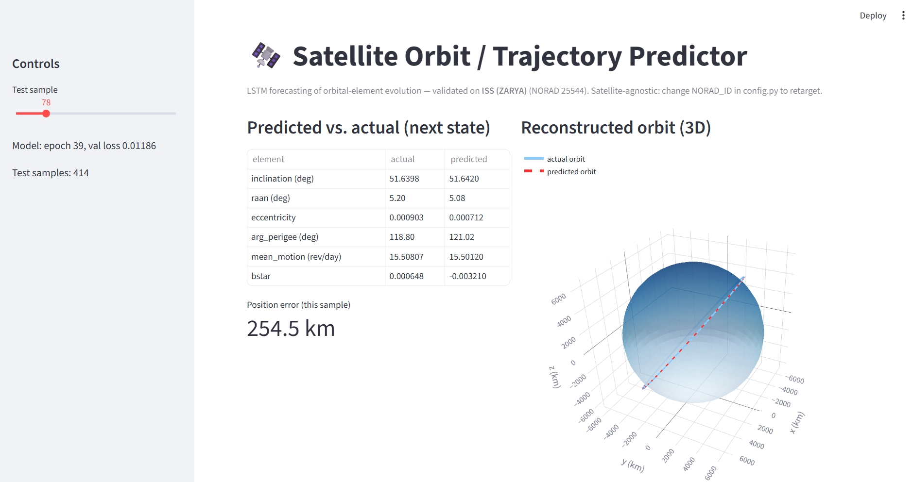

# Satellite Orbit Trajectory Predictor

A machine learning system that forecasts a satellites future orbit by learning
how its orbital elements evolve over time. The model is a Long Short-Term Memory
(LSTM) network trained on one year of real tracking data for the International
Space Station (ISS), and it reconstructs the satellites 3-dimensional
position from the predicted elements using the SGP4 propagator.

It is ready-to-use system that handles everything automatically: it pulls live data, clean it, trains a model, and measures accuracy in real-world units like kilometers through an interactive web demo. I tested it on the ISS, but you can easily point it at any other satellite or tracked object just by changing a single ID.

---

## Table of Contents

1. [Problem Statement](#1-problem-statement)
2. [What the Project Does](#2-what-the-project-does)
3. [Background: TLEs, SGP4, and Orbital Elements](#3-background-tles-sgp4-and-orbital-elements)
4. [Dataset](#4-dataset)
5. [Independent and Target Variables](#5-independent-and-target-variables)
6. [How the System Works (End-to-End Flow)](#6-how-the-system-works-end-to-end-flow)
7. [Model and Algorithms](#7-model-and-algorithms)
8. [Training](#8-training)
9. [Evaluation and Metrics](#9-evaluation-and-metrics)
10. [Results](#10-results)
11. [The Two Key Engineering Decisions](#11-the-two-key-engineering-decisions)
12. [Interactive Demo](#12-interactive-demo)
13. [Project Structure](#13-project-structure)
14. [Installation and Usage](#14-installation-and-usage)
15. [Using the Trained Model Elsewhere](#15-using-the-trained-model-elsewhere)
16. [Applying It to Other Satellites](#16-applying-it-to-other-satellites)
17. [Applications](#17-applications)
18. [Limitations and Future Work](#18-limitations-and-future-work)
19. [Interview Questions and Answers](#19-interview-questions-and-answers)

---

## 1. Problem Statement

Right now, thousands of things are floating around our Mother Earth like satellites, old rocket parts,debris, space junk and etc etc. Knowing where these things will be tomorrow is super important so they don't crash into each other. If just one crash happens, it makes thousands of new pieces of trash, which can then hit other stuff. This snowball effect is called the Kessler Syndrome.

To figure out where a satellite is going, people usually use a math model called SGP4. It's fast and everyone uses it, but it has a big problem: it's not great at guessing the forces that slowly mess with orbits, like air drag from the atmosphere and pressure from the sun. Because of this, its predictions can be off by kilometers after just a few days.

This project looks at one simple question: **can a smart data model figure out how an orbit changes over time, and use that to guess where a satellite will go next?** Instead of just trusting standard physics equations, the model learns by looking at the satellite's past tracking history.

---

## 2. What the Project Does

In one sentence: the system looks at the last thirty recorded orbital states of a
satellite and predicts the next one, then converts that prediction into a real
three-dimensional position in space.

In Simple terns:

- It Automatically downloads one year of real ISS tracking data.
- Converts each raw tracking record into a set of orbital elements.
- Prepares the data as overlapping time windows suitable for sequence modeling.
- Trains an LSTM network to predict the next orbital state from the previous
  thirty states.
- Measures the prediction accuracy in kilometers by reconstructing the physical
  position.
- Presents everything through an interactive web application with a rotating
  three-dimensional view of the predicted orbit.

---

## 3. Background: TLEs, SGP4, and Orbital Elements

Understanding three concepts makes the rest of the project clear.

**Two-Line Element set (TLE).** A TLE is a compact, standardized text format that
describes a satellite's orbit at one specific moment, called the epoch. It looks
like this for the ISS:

```
1 25544U 98067A   24001.01267188  .00016541  00000-0  29758-3 0  9991
2 25544  51.6422  68.6294 0003347 343.4617  78.0593 15.49961425432470
```

Although it appears cryptic, it simply encodes the orbit's shape, orientation,
and the satellite's position along that orbit at the epoch time. The format is
old and terse because it was originally designed to fit on punch cards.

**Orbital elements.** These are the numbers that define an orbit. The ones used
in this project are:

- Inclination: the tilt of the orbit relative to the equator.
- Right Ascension of the Ascending Node (RAAN): where the orbit crosses the
  equator going north.
- Eccentricity: how circular or elliptical the orbit is.
- Argument of perigee: the orientation of the ellipse within the orbital plane.
- Mean motion: how many orbits the satellite completes per day.
- B-star (bstar): a drag term that captures how quickly the orbit is decaying.

**SGP4.** This is the standard mathematical model that takes a TLE and computes
the satellite's position and velocity at any requested time. In this project SGP4
is used in two ways: to read the orbital elements out of each TLE, and later to
convert predicted elements back into a physical position so accuracy can be
measured in kilometers.

---

## 4. Dataset

The data comes from Space-Track.org, the official public catalog operated by the
United States. Access is free after registering for an account, and the download
is fully automated inside the project using the `spacetrack` Python library.

| Property | Value |
| --- | --- |
| Source | Space-Track.org (via the `spacetrack` library) |
| Satellite | International Space Station, ISS (NORAD ID 25544) |
| Time span | One full year (2024) |
| Raw records downloaded | 2,439 TLE sets |
| Clean records after processing | 2,217 |

The raw download is a text file of TLE sets, one per epoch, spread across the
year. Because the ISS is in a low orbit where atmospheric drag is significant,
its orbit changes in a clear and measurable way over the year, which makes it a
good subject for learning.

During processing, duplicate epochs and any records that could not be parsed were
removed, reducing the 2,439 raw records to 2,217 clean orbital states.

---

## 5. Independent and Target Variables

This is a time-series forecasting problem, so the input and the target are the
same set of variables, separated in time.

**Independent variables (the input, X).** At each timestep the state is described
by eight features. Two of the angular elements are encoded as sine and cosine
pairs (explained in section 11), which is why there are eight features rather
than six:

1. Inclination
2. RAAN, sine component
3. RAAN, cosine component
4. Eccentricity
5. Argument of perigee, sine component
6. Argument of perigee, cosine component
7. Mean motion
8. B-star

The model receives thirty consecutive timesteps of these eight features, so each
input sample has the shape (30, 8).

**Target variable (the output, y).** The model predicts the same eight features,
but for the single next timestep. Each target has the shape (8,).

Because the input features and the target are the same quantities shifted forward
by one step, this is an autoregressive, sequence-to-one regression task.

---

## 6. How the System Works (End-to-End Flow)

The pipeline is divided into clear stages, each implemented in its own file.

```
data_loader.py  ->  propagate.py  ->  preprocess.py  ->  model.py + train.py  ->  evaluate.py  ->  app.py
   download          TLE to            scale, window        define and             measure           interactive
   raw TLEs          orbital           and split by         train the LSTM         accuracy          3D demo
                     elements          time                                        in km
```

1. **Download.** `data_loader.py` connects to Space-Track and saves one year of
   ISS TLEs to disk.
2. **Transform.** `propagate.py` reads the orbital elements out of each TLE,
   encodes the angles as sine and cosine pairs, and writes a clean table of
   states to a CSV file.
3. **Prepare.** `preprocess.py` scales the features to a common range, splits the
   data by time into training and testing portions, and slices each portion into
   overlapping thirty-step windows.
4. **Model and train.** `model.py` defines the LSTM, and `train.py` runs the
   training loop, saving the best model as a checkpoint.
5. **Evaluate.** `evaluate.py` loads the trained model, predicts on the test set,
   reconstructs positions with SGP4, reports the error in kilometers, and saves
   the plots.
6. **Demonstrate.** `app.py` provides a web interface to explore predictions
   sample by sample, including a rotating three-dimensional orbit view.

---

## 7. Model and Algorithms

The central model is an LSTM network, chosen because orbit data is sequential:
the next state depends on the recent history of motion. Unlike models that treat
each row independently, an LSTM has internal memory that captures how a quantity
evolves across a sequence, which is exactly what is needed here.

| Component | Choice | Purpose |
| --- | --- | --- |
| Main model | LSTM, 2 layers, 64 hidden units | Learns how the orbital elements evolve |
| Model size | 52,102 trainable parameters | Small and fast; trains on CPU in seconds |
| Physics tool | SGP4 | Reads elements from TLEs and rebuilds positions |
| Feature engineering | Sine and cosine angle encoding | Removes the angle wraparound discontinuity |
| Scaling | MinMax scaling to the 0 to 1 range | Puts all eight features on a comparable scale |
| Loss function | Mean Squared Error | Standard objective for regression |
| Optimizer | Adam, learning rate 0.001 | Updates the network weights |
| Windowing | Sliding window of 30 steps | Turns the series into supervised samples |

The network reads the thirty-step input sequence, keeps a running internal
summary of the motion, takes the summary from the final step, and passes it
through a single linear layer that produces the eight predicted values.

---

## 8. Training

The data was divided strictly by time rather than randomly. The first eighty
percent of the year was used for training and the final twenty percent for
testing. This chronological split is important: shuffling the data would allow
the model to learn from future information while being tested on the past, an
error known as data leakage. Splitting by time mirrors how the model would be
used in reality, where only past data is available.

| Data stage | Count |
| --- | --- |
| Clean orbital states | 2,217 |
| Training rows (first 80 percent) | 1,773 |
| Testing rows (last 20 percent) | 444 |
| Training samples (windows) | 1,743, shape (1743, 30, 8) |
| Testing samples (windows) | 414, shape (414, 30, 8) |

The number of windows is slightly smaller than the number of rows because the
first thirty rows of each portion are consumed to form the first complete window.

Training ran for fifty epochs with a batch size of sixty-four. Each epoch, for
each batch, the model made a prediction, the error was measured, the error was
propagated backward, and the optimizer adjusted the weights. After each epoch the
model was checked against the test set, and the best-performing version was saved.
On a standard laptop CPU the entire training completed in roughly twenty seconds.

### Learning Curve

The plot below shows the training and validation loss falling smoothly over the
fifty epochs and then leveling off. The two curves stay close together, which
indicates the model is generalizing rather than memorizing the training data.



---

## 9. Evaluation and Metrics

Several metrics were used, each answering a different question.

| Metric | What it measures | Why it was used |
| --- | --- | --- |
| Mean Squared Error (MSE) | Average squared error during training | The optimization objective; penalizes large errors strongly |
| Root Mean Squared Error (RMSE) | Error in the same units as each element | Interpretable per-element accuracy |
| Mean Absolute Error (MAE) | Average absolute miss | A robust, easy-to-read average error |
| Position error in kilometers | Physical distance between predicted and actual position | The headline metric that a non-specialist can understand |
| Circular angle error | Wrap-aware difference between two angles | Honest accuracy for angles, where 359 degrees and 1 degree are close |

The position error is the most important result. It is computed by taking both
the true and the predicted orbital elements, reconstructing a physical position
for each using SGP4, and measuring the straight-line distance between the two in
kilometers. This translates the abstract element errors into a single number that
directly reflects real-world usefulness.

Reporting both RMSE and MAE together is deliberate. When RMSE is noticeably larger
than MAE, it signals the presence of a few large outliers. In this project the
position RMSE is larger than the mean, which correctly flags a small number of
harder cases rather than a uniformly poor result.

---

## 10. Results

The model learned the slowly changing elements very well and handled the faster
changing angles reasonably.

| Orbital element | RMSE | Assessment |
| --- | --- | --- |
| Inclination | 0.0024 degrees | Excellent |
| Eccentricity | 0.00016 | Excellent |
| Mean motion | 0.0066 revolutions per day | Excellent |
| RAAN | 6.14 degrees | Good; this element precesses fastest and is hardest |
| Argument of perigee | 6.84 degrees | Good |
| B-star | 0.0065 | Noisy, as expected for a drag term |

**Headline position accuracy: approximately 594 km median error and 760 km mean
error on the held-out test set.**

### Predicted versus Actual Elements

The plot below overlays the model's predictions (orange) on the true values
(blue) across the test period. The predictions track the true values closely for
inclination, eccentricity, and mean motion. The rising trend in mean motion is
the signature of atmospheric drag slowly lowering the orbit, and the model
captures it well. The sudden vertical jumps in RAAN and argument of perigee are
angles wrapping from 360 degrees back to 0 degrees, not prediction errors.



### Position Error Distribution

The histogram below shows the distribution of position error across the test set.
Most predictions cluster at the lower end, with a tail of harder cases.



> Note: the histogram shown here was generated from an earlier run and displays a
> mean of about 1,783 km. After the sine and cosine angle encoding was added, the
> mean improved to roughly 760 km and the median to roughly 594 km. Re-running
> `evaluate.py` will regenerate this figure with the improved numbers.

---

## 11. The Two Key Engineering Decisions

Two decisions shaped the project and are worth understanding in detail, because
they are the strongest part of the engineering story.

**Decision one: predict orbital elements, not raw position.** The first approach
tried to predict the raw x, y, and z position directly. This failed and the
training loss quickly stopped improving. The reason is timing: consecutive ISS
tracking records are about four and a half hours apart, but the ISS completes an
orbit every ninety-three minutes. Between two records the satellite has therefore
travelled nearly three full orbits, so its raw position jumps to an almost
unrelated point each time. That is effectively impossible to predict. Orbital
elements, by contrast, change slowly and smoothly, so switching the target to
elements turned an unlearnable problem into a learnable one.

**Decision two: encode angles with sine and cosine.** Two of the elements, RAAN
and argument of perigee, are angles that wrap around from 360 degrees back to 0
degrees. To a model reading raw degrees, that wrap looks like an enormous jump,
even though 359 degrees and 1 degree are almost the same direction. Encoding each
angle as a pair of sine and cosine values places these points right next to each
other on a circle, removing the artificial discontinuity. This single change
reduced the median position error by roughly a factor of two.

---

## 12. Interactive Demo

The demo is a web application built with Streamlit. A slider selects any sample
from the test set. For that sample the application shows a table comparing the
predicted and actual elements, the position error in kilometers, and a rotating
three-dimensional view of Earth with the actual orbit and the predicted orbit
drawn around it.




To launch the demo:

```bash
streamlit run src/app.py
```

---

## 13. Project Structure

```
orbit_predictor/
├── data/
│   ├── raw/                 downloaded TLE text files
│   └── processed/           cleaned orbital-element CSV files
├── models/
│   ├── lstm_orbit_checkpoint.pth   trained model checkpoint
│   ├── scaler.joblib               the fitted feature scaler
│   ├── history.npz                 saved training loss curve
│   └── plots/                      evaluation figures
├── src/
│   ├── config.py            all settings in one place
│   ├── data_loader.py       downloads TLEs from Space-Track
│   ├── propagate.py         converts TLEs to orbital elements
│   ├── preprocess.py        scaling, windowing, and time-based split
│   ├── model.py             the LSTM architecture
│   ├── train.py             training loop and checkpoint saving
│   ├── evaluate.py          metrics, position error, and plots
│   └── app.py               Streamlit demo
├── requirements.txt
├── .env                     Space-Track credentials (not committed)
└── README.md
```

---

## 14. Installation and Usage

**Step 1. Create and activate a virtual environment.**

```bash
python -m venv venv
# Windows
venv\Scripts\activate
# Linux or macOS
source venv/bin/activate
```

**Step 2. Install the dependencies.**

```bash
pip install -r requirements.txt
```

**Step 3. Provide Space-Track credentials.** Create a file named `.env` in the
project root containing your free Space-Track account details:

```
SPACETRACK_USER=your_email@example.com
SPACETRACK_PASS=your_password
```

**Step 4. Run the pipeline in order.**

```bash
cd src
python data_loader.py     # download the raw TLEs
python propagate.py       # convert to orbital elements
python preprocess.py      # scale, window, and split
python train.py           # train the model
python evaluate.py        # measure accuracy and save plots
streamlit run app.py      # launch the interactive demo
```

---

## 15. Using the Trained Model Elsewhere

The model is saved as a checkpoint dictionary rather than as raw weights alone.
This is the recommended approach because it stores everything needed to rebuild
and reproduce the model:

```python
{
    "model_state_dict": ...,       # the learned weights
    "optimizer_state_dict": ...,   # allows training to resume
    "epoch": 39,
    "val_loss": 0.011857,
    "hyperparams": {...},          # architecture settings
}
```

The feature scaler is saved separately as `scaler.joblib`. Keeping the scaler is
essential, because predictions are made in scaled space and must be converted back
to real units using the exact same scaler that was fitted during training.

To load and use the model in another script:

```python
import torch, joblib
import numpy as np
from model import build_model

# Recreate the architecture and load the trained weights
checkpoint = torch.load("models/lstm_orbit_checkpoint.pth", map_location="cpu")
model = build_model(device="cpu")
model.load_state_dict(checkpoint["model_state_dict"])
model.eval()

# Load the scaler that was fitted during training
scaler = joblib.load("models/scaler.joblib")

# window is a scaled array of shape (1, 30, 8)
with torch.no_grad():
    prediction_scaled = model(torch.from_numpy(window).float()).numpy()

# Convert the prediction back to real orbital-element units
prediction = scaler.inverse_transform(prediction_scaled)
```

The simplest way for someone else to use the project is to clone the repository,
install the requirements, and either run the pipeline or launch the Streamlit
demo, which requires no coding at all.

---

## 16. Applying It to Other Satellites

The pipeline is not limited to the ISS. It is satellite-agnostic. To target a
different object, change the identifier in `config.py`:

```python
NORAD_ID = 20580             # for example, the Hubble Space Telescope
SATELLITE_NAME = "HST (Hubble)"
```

Then re-run the pipeline from `data_loader.py` through `evaluate.py`. A new model
must be trained for the new satellite, because different orbits have different
characteristics; the scaler and windows are rebuilt automatically during that
re-run.

Different orbits reveal different behavior. A higher satellite experiences less
atmospheric drag, so its mean motion drifts more slowly than the ISS. Validating
the same pipeline across several orbit types is a natural way to demonstrate that
it generalizes beyond a single object.

---

## 17. Applications

- **Collision avoidance.** Predicting future positions supports the assessment of
  close approaches between satellites and debris.
- **Space traffic management.** Accurate forecasts are the foundation of
  coordinating the growing number of objects in orbit.
- **Re-entry prediction.** Estimating how an orbit decays helps predict when a
  satellite will return to the atmosphere.
- **Mission planning.** Knowing where a satellite will be supports ground-station
  scheduling and imaging opportunities.
- **Constellation operations.** Large fleets such as communications
  constellations rely on continuous, accurate orbit knowledge to stay safe.

---

## 18. Limitations and Future Work

Being clear about the limitations is part of an honest engineering account.

- The median error of roughly 594 km is suitable for a proof of concept but is
  not operational-grade. Operational systems achieve sub-kilometer accuracy using
  precise ephemeris data and more sophisticated estimation methods.
- B-star, the drag term, is inherently noisy and is the hardest element to
  predict. Its effect on short-term position is small, which is why the position
  error remains stable despite the noisy B-star predictions.
- The model was trained and validated on a single satellite, so generalization
  across orbit types has not yet been demonstrated.
- The model predicts one step ahead. Forecasting far into the future would require
  feeding predictions back in repeatedly, which causes errors to accumulate.
- Satellite maneuvers, such as the periodic reboosts of the ISS, appear as sudden
  jumps that the model cannot anticipate.

Directions for improvement include predicting the residual error of SGP4 rather
than the elements directly, training across many satellites, experimenting with
alternative sequence architectures, and extending to multi-step forecasting.

---

## 19. Interview Questions and Answers

**What is a TLE?**
A Two-Line Element set is a compact text format describing a satellite's orbit at
a specific moment, encoding the orbital elements needed to propagate the orbit.

**What is SGP4 and what is its limitation?**
SGP4 is the standard analytical propagator that converts a TLE into position and
velocity. Its limitation is that it cannot perfectly model perturbations such as
atmospheric drag, so its accuracy degrades over days.

**Why use an LSTM rather than a simpler model?**
Orbit data is a time series in which the next state depends on the recent history.
An LSTM has memory that captures those temporal dependencies, unlike a model that
treats each observation independently.

**How did you prevent data leakage?**
By splitting the data chronologically instead of randomly, and by fitting the
scaler only on the training portion. This ensures the model is never exposed to
future information during training.

**Why predict orbital elements instead of raw position?**
Because consecutive records are spaced nearly three orbits apart, raw position
jumps unpredictably between samples. Orbital elements change slowly and smoothly,
which makes them learnable.

**Why encode angles with sine and cosine?**
Angles wrap from 360 degrees to 0 degrees, which a model reading raw degrees
interprets as a huge jump. Sine and cosine encoding removes this discontinuity and
reduced the median position error by roughly half.

**What does the model actually predict?**
Given the last thirty orbital states, it predicts the next orbital state, which is
then converted into a physical position using SGP4.

**Is it limited to the ISS?**
No. The ISS was the validation case, but the pipeline works for any catalogued
object by changing its NORAD identifier and re-running.

**Why is B-star hard to predict, and does it matter?**
B-star is a noisy drag term that fluctuates with atmospheric density. It is hard
to predict, but it has little effect on short-term position, so overall accuracy
remains stable.

**How would you forecast further into the future?**
By feeding each prediction back as input to predict the following step, while
recognizing that errors accumulate the further ahead the forecast extends.
